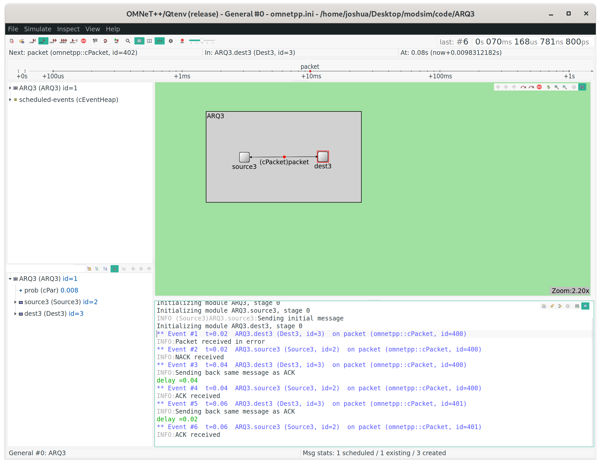
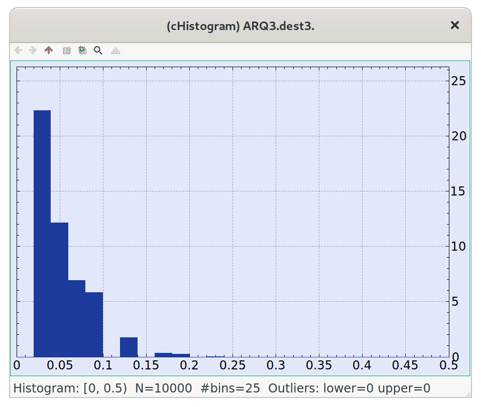
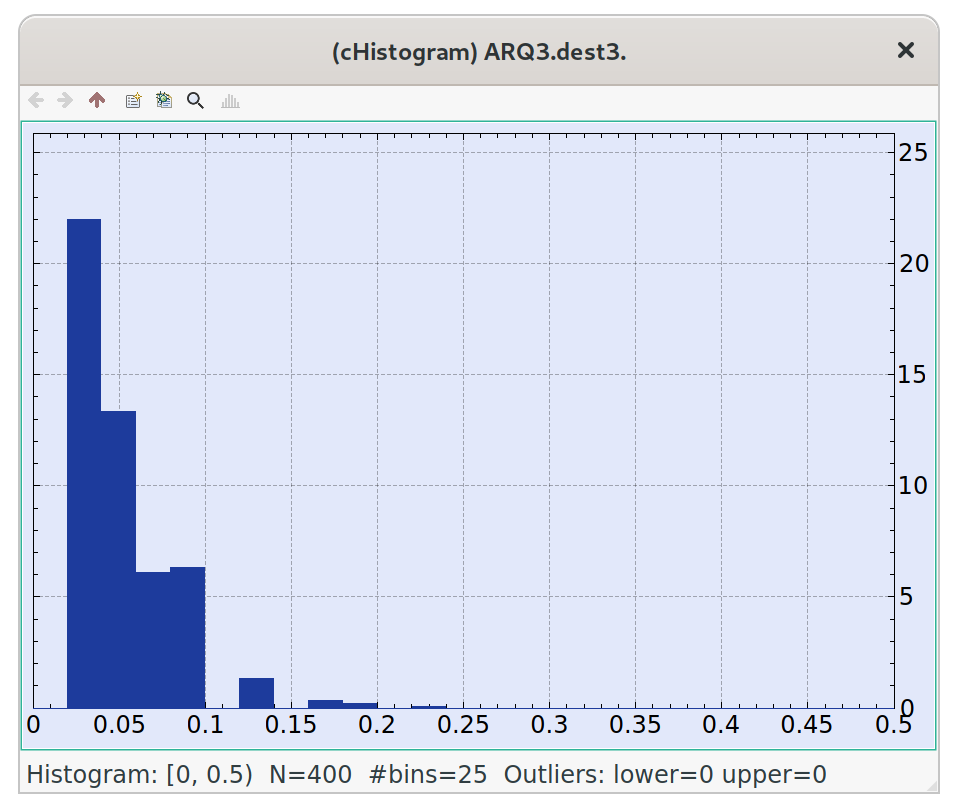

# homework 5a

*I pledge my honor that I have abided by the Stevens Honor System. - Joshua Schmidt* 3/12/2020

## running original

\newpage

## original histogram output (10000 samples)

\newpage

## modified output - p=0.008, 400 samples

\newpage

For p=0.008 and 400 samples, it looks like the majority of the samples occur between 0 and 0.1. So the bin sizes for the histogram should equally divide the samples. If there is a bin size of 8, that would divide the samples into 50 separate bins, and by making the max of the histogram at 0.25 instead of 0.5, the data would be easier to view. If the bins are too big or too small, the histogram doesn't show any useful information. So I think 50 cells at a bin size of 8 is a good medium.

## distribution for delay

The histogram for the delay closely mirrors a Geometric distrubution.

## justification

We expect to see a Geometric distribution for the packet delay, because we are counting how many resends it takes until there is a single success. Getting a success or not is binomial with 100 bits and a probability of failure of 0.008. The probability is $q^{x-1} \cdot p$, with an expected value of $\frac{1}{p}$, and a variance of $\frac{q}{p^2}$. The probability of success is 44.788\%, and of failure is 55.2114\%. This leads to an expected value of $\frac{1}{44.788}$, or $2.2327$. Experimentally, the expected value is $\frac{44.1}{20}$, or $2.205$. The error in the mean is $\frac{|2.205-2.2327|}{2.2327} \cdot 100\%$, or $1.24\%$. For standard deviation, the calculated value is $0.1659$. The experimental value is $\frac{3.17444}{20}$, or $0.158722$. This results in an error in the standard deviation of $\frac{|0.16590-0.158722|}{0.16590}$, or $4.328\%$. Since the errors are each below 5\%, it is safe to say that this dataset follows a geometric distribution.
