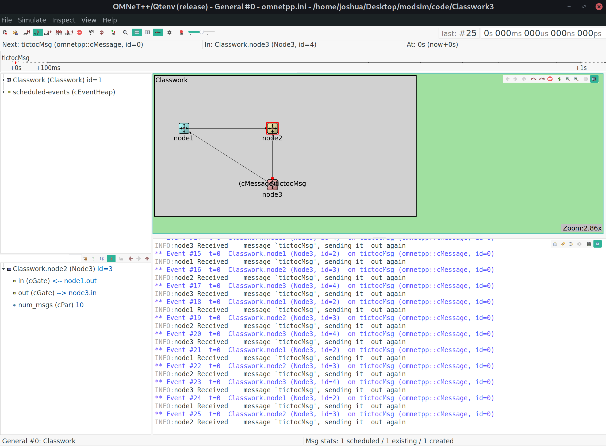
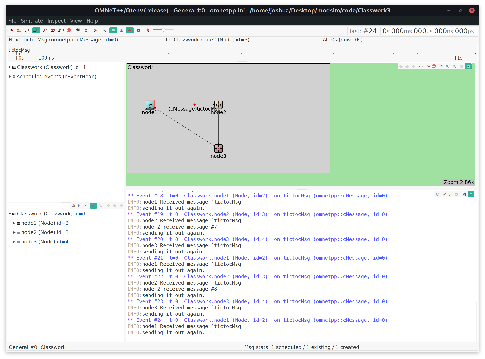

# classwork 3

*I pledge my honor that I have abided by the Stevens Honor System. - Joshua Schmidt, Shivam Sheth* 2/9/2020

## no modifications

{ width=100% }

## modified c++ file

```cpp
#include <omnetpp.h>
#include <string.h>

using namespace omnetpp;

const int maxNode2Receive = 10;

class Node : public cSimpleModule {
 protected:
  virtual void initialize() override;
  virtual void handleMessage(cMessage *msg) override;

 private:
  unsigned int messageReceiveCount = 0;
};
Define_Module(Node);
void Node::initialize() {
  if (strcmp("node1", getName()) == 0) {
    EV << "Sending initial message" << endl;
    cMessage *msg = new cMessage("tictocMsg");
    send(msg, "out");
  }
}
void Node::handleMessage(cMessage *msg) {
  EV << getName() << " received message " << msg->getName() << endl;
  messageReceiveCount++;
  bool sendMessage = true;
  if (strcmp("node2", getName()) == 0) {
    EV << "node 2 receive message #" << messageReceiveCount << endl;
    sendMessage = messageReceiveCount != maxNode2Receive;
  }
  if (sendMessage) {
    EV << "sending it out again" << endl;
    send(msg, "out");
  }
}
```

## modified ned file

```ned
simple Node
{
  parameters:
    @display("i=block/routing");
    int num_msgs = 10;
  gates:
    input in;
    output out;
}
network Classwork
{
  @display("bgb=342,184");
  submodules:
    node1: Node {
      parameters:
        @display("i=,cyan;p=38,69");
    }
    node2: Node {
      parameters:
        @display("i=,gold;p=154,69");
    }
    node3: Node {
      parameters:
        @display("i=,red;p=154,143");
    }
  connections:
    node1.out --> node2.in;
    node2.out --> node3.in;
    node3.out --> node1.in;
}
```

## stops at 10th node2 receive

{ width=100% }
