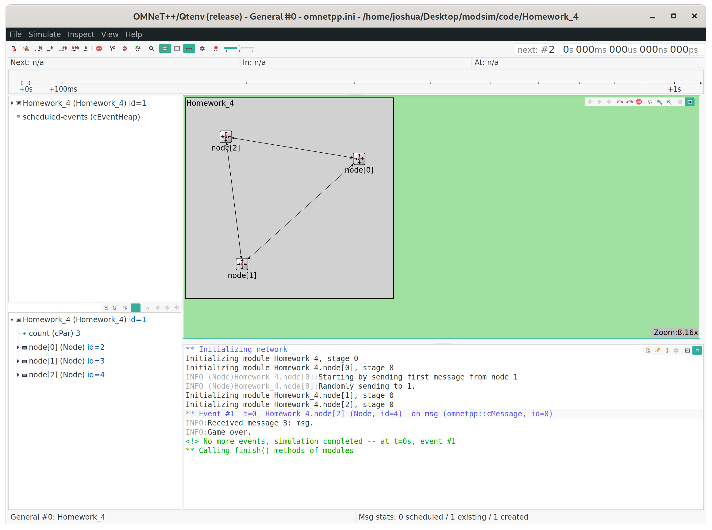

# homework 4

*I pledge my honor that I have abided by the Stevens Honor System. - Joshua Schmidt* 2/26/2020

## running file

{ width=100% }

## Node.cc

```cpp
#include "Node.h"

Define_Module(Node);

void Node::sendMessage(cMessage *msg) {
    int outindex;
    double prob = uniform(0, 1);
    if (strcmp("node[0]", getFullName()) == 0) {
        if (prob < 0.1) {
            // to node 2
            outindex = 0;
        } else {
            // to node 3
            outindex = 1;
        }
    } else if (strcmp("node[1]", getFullName()) == 0) {
        if (prob < 0.9) {
            // to node 1
            outindex = 0;
        } else {
            // to node 3
            outindex = 1;
        }
    } else if (strcmp("node[2]", getFullName()) == 0) {
        EV << "Game over.\n";
        return;
    } else {
        EV << "Invalid node index.\n";
        return;
    }
    EV << "Randomly sending to " << outindex << ".\n";
    send(msg, "out", outindex);
}

void Node::initialize() {
    if (strcmp("node[0]", getFullName()) == 0) {
        EV << "Starting by sending first message from node 1\n";
        cMessage *msg = new cMessage("msg");
        sendMessage(msg);
    }
}

void Node::handleMessage(cMessage *msg) {
    int count = getAncestorPar("count");
    counter++;
    EV << "Received message " << count << ": " << msg->getName() << ".\n";
    sendMessage(msg);
}
```

## Node.ned

```ned
simple Node
{
    parameters:
        @display("i=block/routing");
    gates:
        input in[];
        output out[];
}
```

## Node.h

```cpp
#ifndef __HOMEWORK_4_NODE_H_
#define __HOMEWORK_4_NODE_H_

#include <omnetpp.h>

using namespace omnetpp;

class Node: public cSimpleModule {
private:
    unsigned long counter = 0;
    void sendMessage(cMessage *msg);
protected:
    virtual void initialize();
    virtual void handleMessage(cMessage *msg);
};

#endif
```

## Homework_4.ned

```ned
network Homework_4
{
    parameters:
        int count = 3;
        @display("bgb=83,80");
    submodules:
        node[count]: Node;
    connections allowunconnected:
        for i=0..count-1, for j=0..count-1 {
            node[i].out++ --> node[j].in++ if i!=j;
        }
}
```
