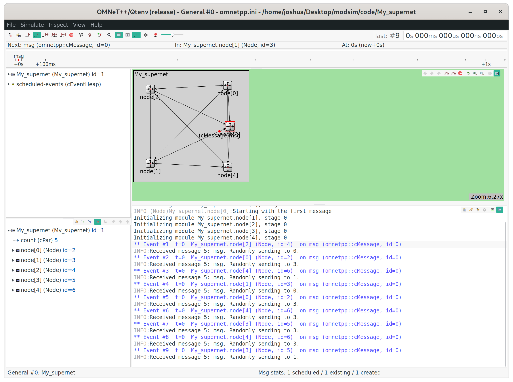

# supernet

*I pledge my honor that I have abided by the Stevens Honor System. - Joshua Schmidt* 2/20/2020

## running file

{ width=100% }

## Node.cc

```cpp
#include "Node.h"

Define_Module(Node);

void Node::initialize() {
    if (strcmp("node[0]", getFullName()) == 0) {
        cMessage *msg = new cMessage("msg");
        send(msg, "out", 1);
        EV << "Starting with the first message\n";
    }
}

void Node::handleMessage(cMessage *msg) {
    int count = getAncestorPar("count");
    counter++;
    int outgateindex = intuniform(0, count - 2);
    send(msg, "out", outgateindex);
    EV << "Received message " << count << ": " << msg->getName()
              << ". Randomly sending to " << outgateindex << ".\n";
}
```

## Node.ned

```ned
simple Node
{
    parameters:
        @display("i=block/routing");
    gates:
        input in[];
        output out[];
}
```

## Node.h

```cpp
#ifndef __MY_SUPERNET_NODE_H_
#define __MY_SUPERNET_NODE_H_

#include <omnetpp.h>

using namespace omnetpp;

class Node: public cSimpleModule {
private:
    unsigned long counter = 0;
protected:
    virtual void initialize();
    virtual void handleMessage(cMessage *msg);
};

#endif
```

## My_supernet.ned

```ned
network My_supernet
{
    parameters:
        int count = 5;
        @display("bgb=83,80");
    submodules:
        node[count]: Node;
    connections allowunconnected:
        for i=0..count-1, for j=0..count-1 {
            node[i].out++ --> node[j].in++ if i!=j;
        }
}
```
