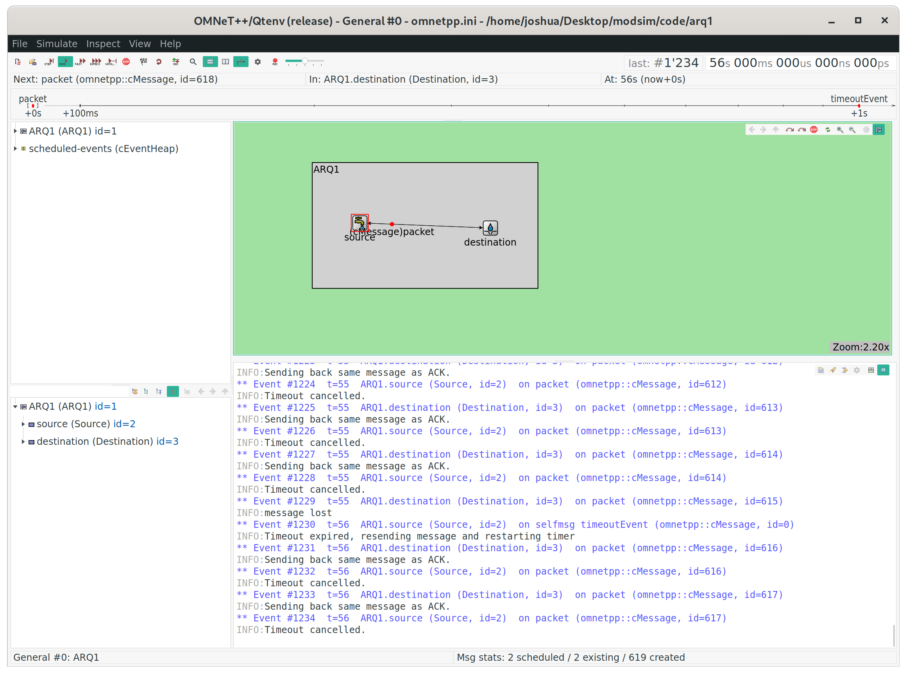

# arq1

*I pledge my honor that I have abided by the Stevens Honor System. - Joshua Schmidt* 2/16/2020

## running file

{ width=100% }

## destARQ.cc

```cpp
#include "destARQ.h"
#include <omnetpp.h>

Define_Module(Destination);

void Destination::initialize() {
    loseProb = par("loseProb").doubleValue();
}

void Destination::handleMessage(cMessage *msg) {
    // lose message with probability of 0.1
    if (uniform(0, 1) < loseProb) {
        EV << "message lost\n";
        bubble("message lost"); // animate
        delete msg;
    } else {
        EV << "Sending back same message as ACK.\n";
        send(msg, "out");
    }
}
```

## destARQ.ned

```ned
simple Destination
{
    parameters:
        @display("i=block/sink");
        double loseProb = default(0.1);
    gates:
        input in;
        output out;
}
```

## destARQ.h

```cpp
#ifndef __ARQ1_DESTARQ_H_
#define __ARQ1_DESTARQ_H_

#include <omnetpp.h>

using namespace omnetpp;

class Destination : public cSimpleModule
{
  protected:
    virtual void initialize() override;
    virtual void handleMessage(cMessage *msg) override;
  private:
    double loseProb;
};

#endif
```

## sourceARQ.cc

```cpp
#include "sourceARQ.h"

Define_Module(Source);

Source::Source() {
    timeout = 1.0;
}

Source::~Source() {
    cancelAndDelete(timeoutEvent);
}

void Source::initialize() {
    timeoutEvent = new cMessage("timeoutEvent"); // schedule timeout for first packet

    // generate and send message
    EV << "Sending initial message\n";
    cMessage *msg = new cMessage("packet");
    send(msg, "out");
    scheduleAt(simTime() + timeout, timeoutEvent);
}

void Source::handleMessage(cMessage *msg) {
    if (msg == timeoutEvent) {
        // receiving timeout event, no acknowledgement (ACK) was received and timer expired
        // therefore don't resend
        EV << "Timeout expired, resending message and restarting timer\n";
        cMessage *newMsg = new cMessage("packet");
        send(newMsg, "out");
        scheduleAt(simTime() + timeout, timeoutEvent);
    } else {
        EV << "Timeout cancelled.\n";
        cancelEvent(timeoutEvent);
        delete msg;

        // send another message
        cMessage *newMsg = new cMessage("packet");
        send(newMsg, "out");
        scheduleAt(simTime() + timeout, timeoutEvent);
    }
}
```

## sourceARQ.ned

```ned
simple Source
{
    parameters:
        @display("i=block/source");
    gates:
        input in;
        output out;
}
```

## sourceARQ.h

```cpp
#ifndef __ARQ1_SOURCEARQ_H_
#define __ARQ1_SOURCEARQ_H_

#include <stdio.h>
#include <omnetpp.h>

using namespace omnetpp;

class Source: public cSimpleModule {
private:
    simtime_t timeout; // timeout for source
    cMessage *timeoutEvent = nullptr; // pointer to timeout

public:
    Source();
    virtual ~Source();

protected:
    virtual void initialize();
    virtual void handleMessage(cMessage *msg);
};

#endif
```

## omnetpp.ini

```ini
[General]
network = ARQ1
**.destination.loseProb = 0.1
```

## myAQR1.ned

```ned
network ARQ1
{
    submodules:
        source: Source {
            @display("p=55,70");
        }
        destination: Destination {
            @display("p=207,76");
        }
    connections:
        source.out --> destination.in;
        destination.out --> source.in;
}
```
