# classwork week 10

*I pledge my honor that I have abided by the Stevens Honor System. - Joshua Schmidt* 4/3/2020

## mm1

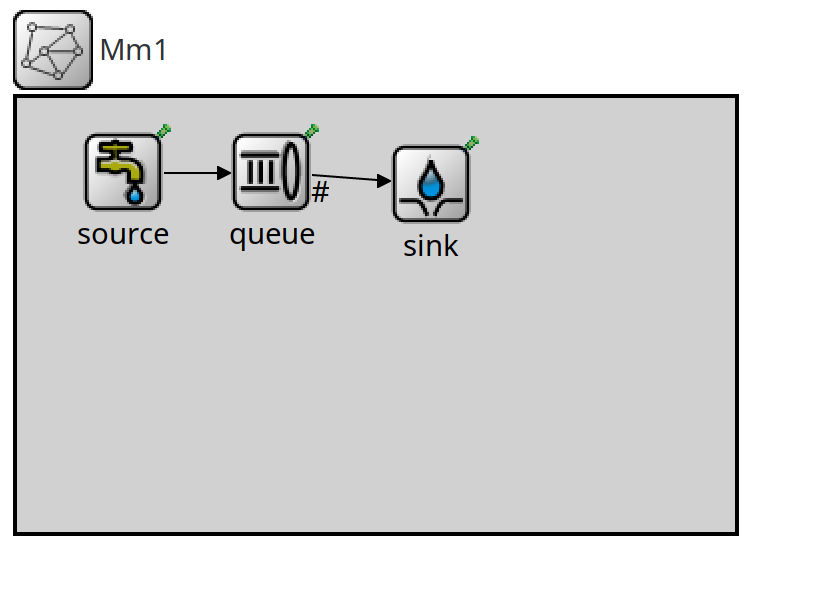{ width=100% }

\newpage

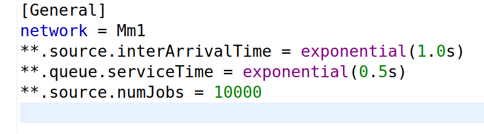{ width=100% }

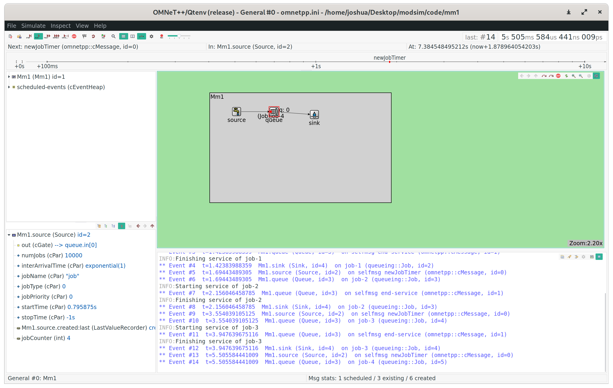{ width=100% }

\newpage

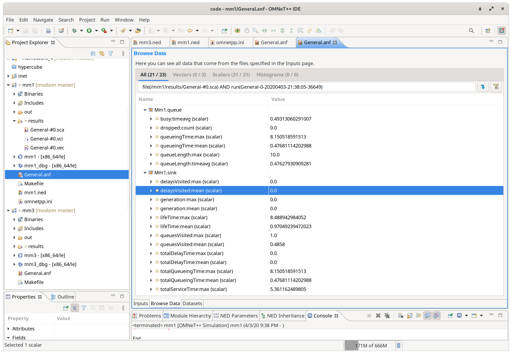{ width=100% }

### analysis

The average queuing time was 0.4768 seconds. The average queue length over time was 0.47627 units. The theoretical average delay in the queue is $\frac{1 + (c \cdot v)^{2}}{2}$, or $\frac{1 + 0}{2} = 0.5$. $0.47627 \approxeq 0.5$, with a margin of error less than $5\%$.

\newpage

## md1

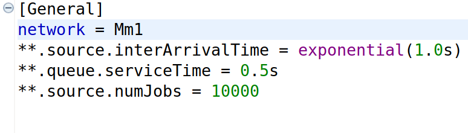{ width=100% }

\newpage

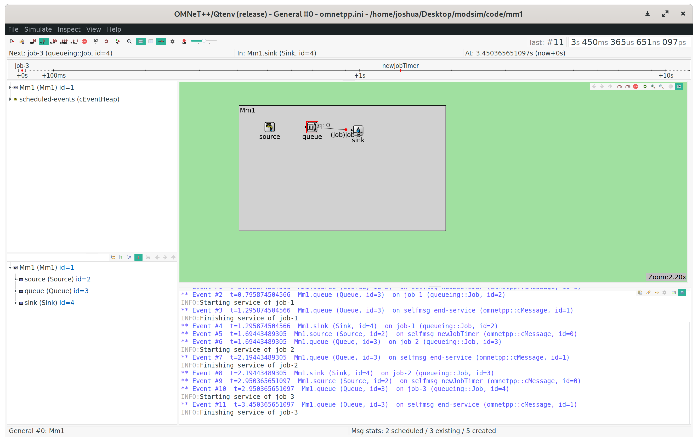{ width=100% }

\newpage

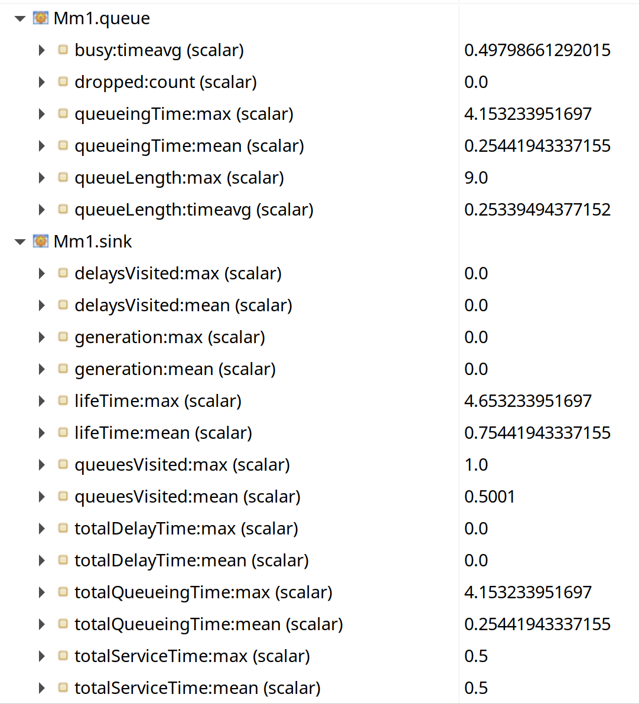{ width=100% }

### analysis

The average queuing time was 0.254419 seconds, with an average queue length of 0.25442 units. The theoretical average delay in the queue is $\frac{1 + (c \cdot v)^{2}}{2}$, with a correction factor of $0.5$. This results in $\frac{1 + 0}{2} \cdot 0.5 = 0.25$. $0.25442 \approxeq 0.25$, with a margin of error less than $5\%$. The M/D/1 average delay is approximately half of the M/M/1 delay, with an experimental ratio of $0.53419$. The average number of customers in the queue is also about half of the M/M/1 data.

\newpage

## mm3

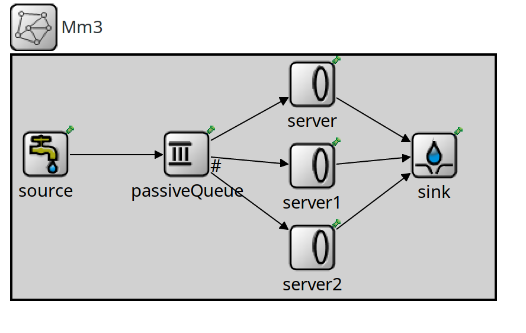{ width=100% }

\newpage

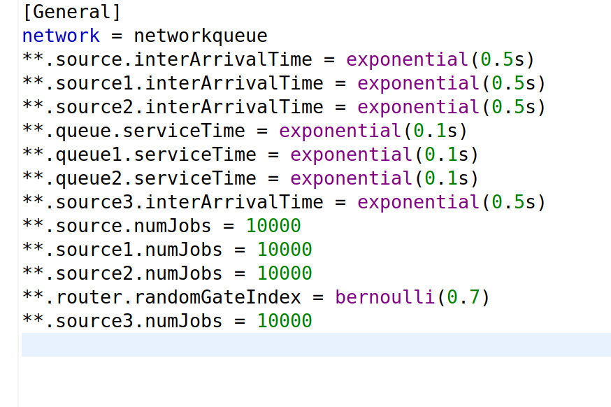{ width=100% }

\newpage

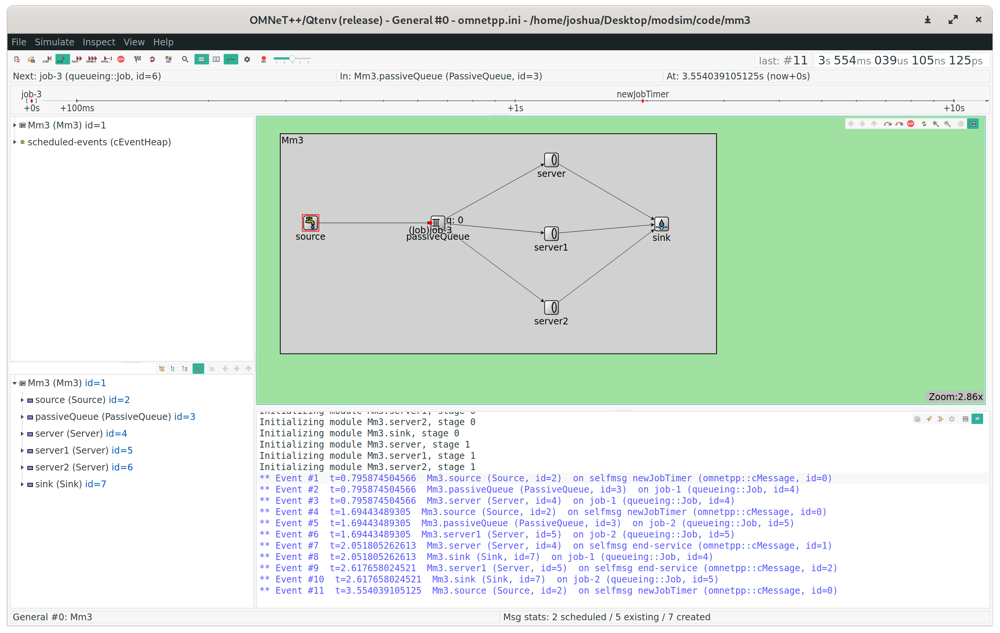{ width=100% }

\newpage

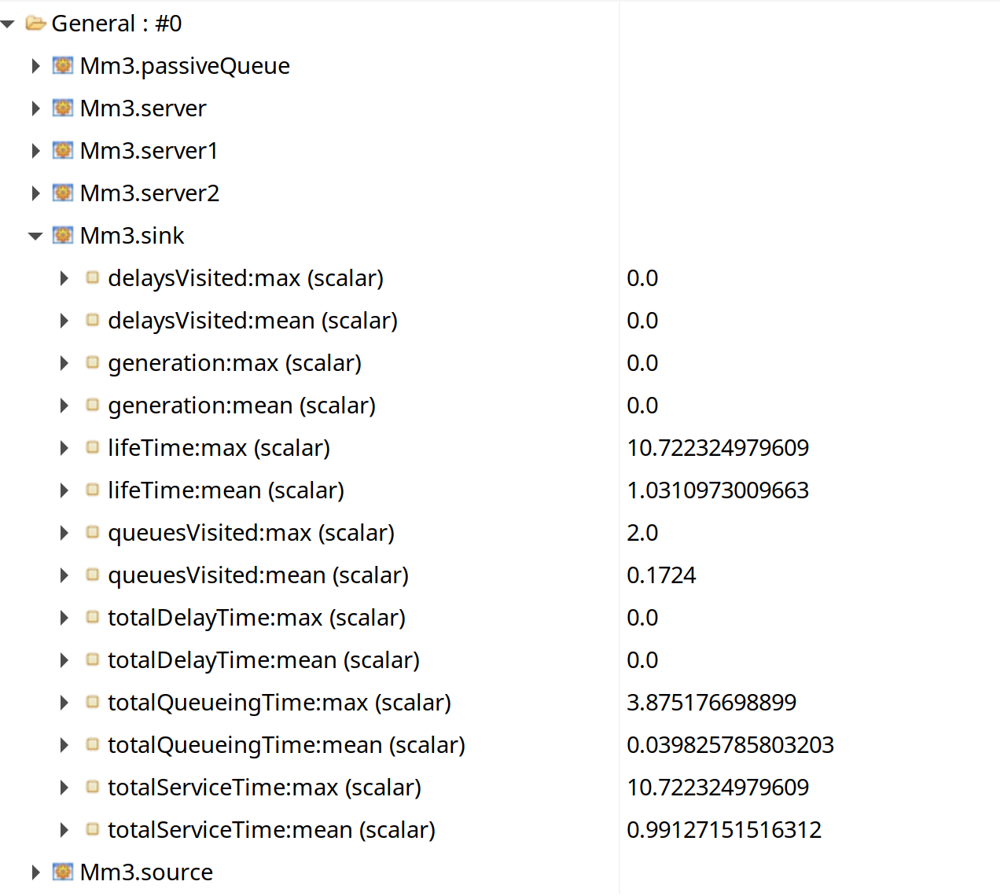{ width=100% }
