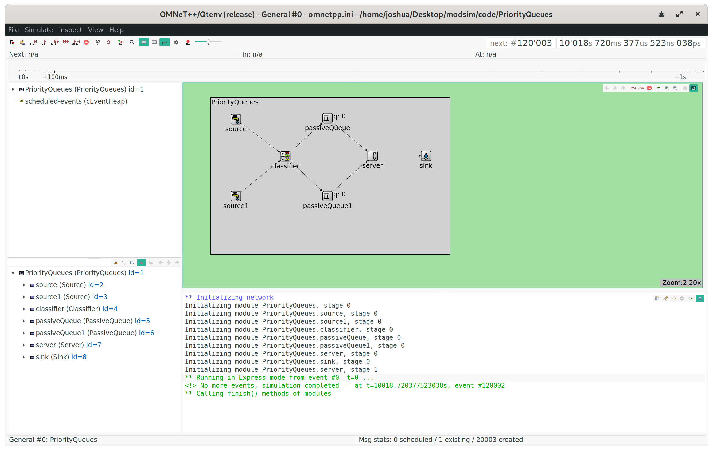
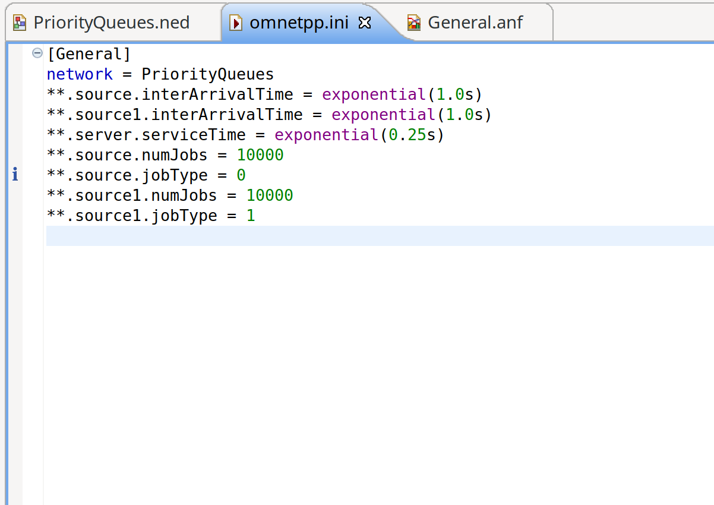
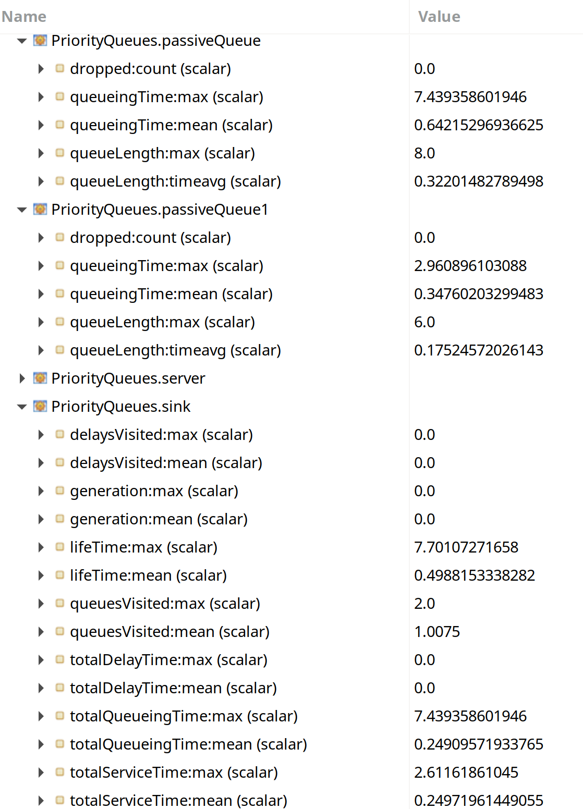
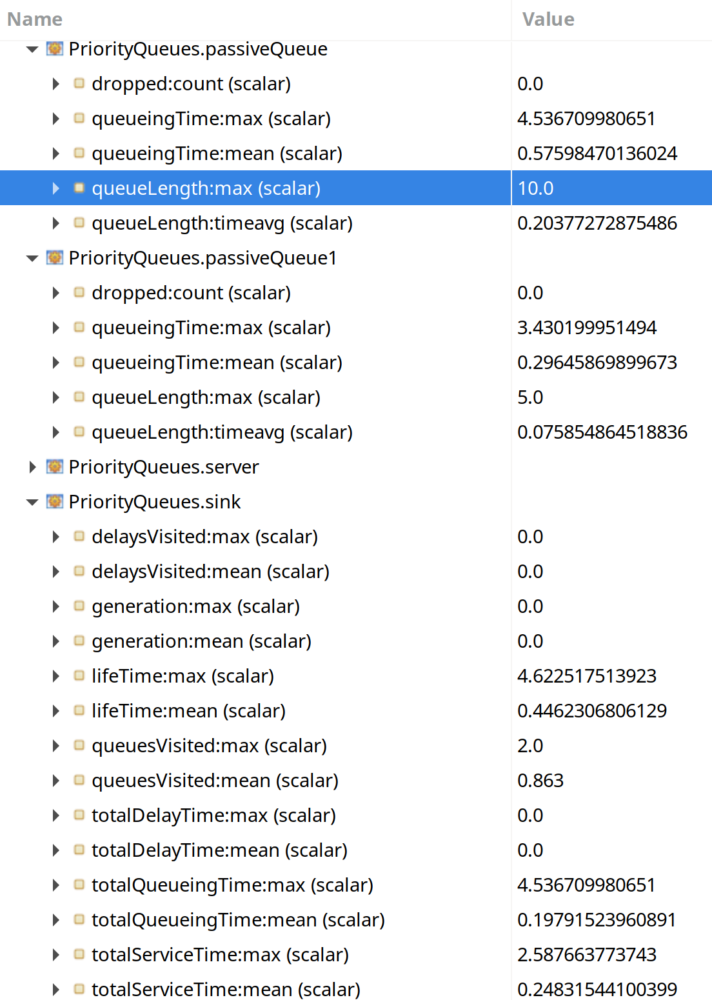
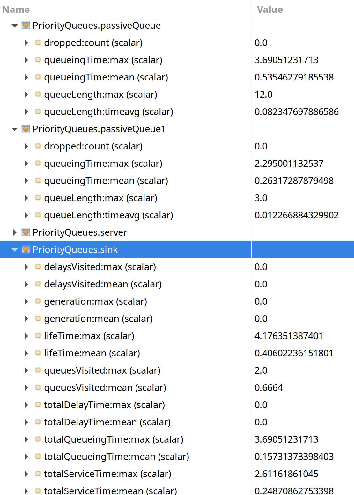
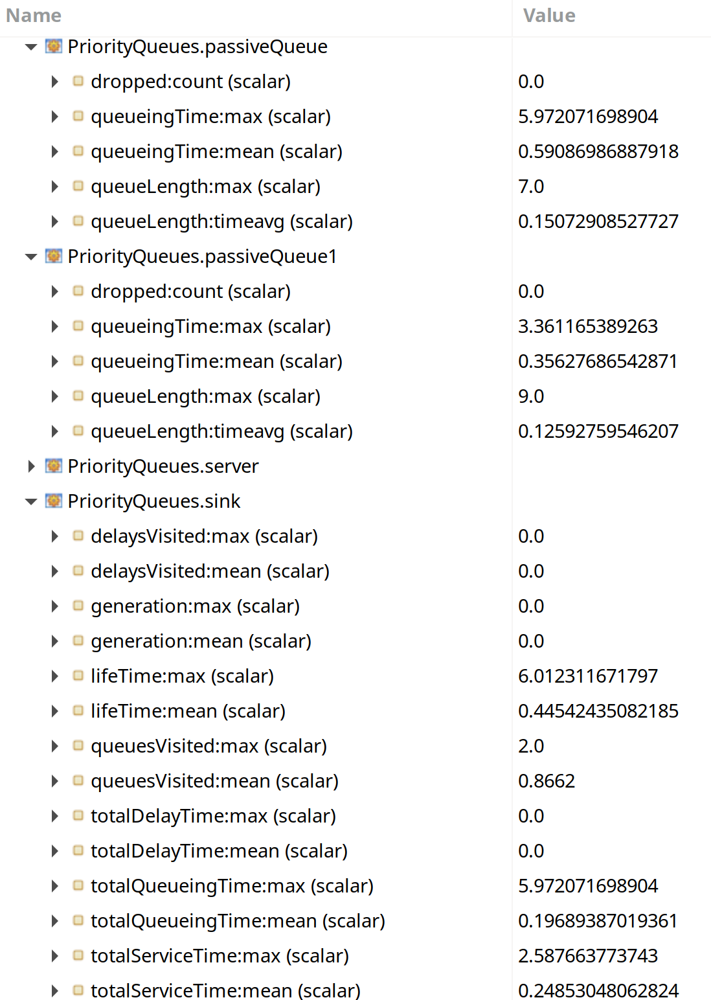

# classwork 11a

*I pledge my honor that I have abided by the Stevens Honor System. - Joshua Schmidt* 4/8/2020

## simulation

{ width=100% }

\newpage

## configuration file

initial `omnetpp.ini` file

{ width=100% }

\newpage

## results

### Poisson arrivals lambda = 1.00 arrival/sec

{ width=82% }

\newpage

### S 1 Poisson lambda = 1.3, S 2 Poisson lambda = 0.7

{ width=82% }

\newpage

### S 1 Poisson lambda = 1.7, S 2 Poisson lambda = 0.3

{ width=82% }

\newpage

### S 1 Poisson lambda = 0.3, S 2 Poisson lambda = 1.7

{ width=82% }

\newpage

### S 1 Poisson lambda = 0.7, S 2 Poisson lambda = 1.3

{ width=82% }

\newpage

## discussion

Changing the rate of arrival into the queues in the system directly impacts the average queuing time, total service time, and the average queuing length for the entire system. With the base case of 1 arrival / second for both queues, the higher priority queue has an average queuing time of about half the lower priority queue, at 0.347 seconds vs. 0.6421 seconds. The queue length for the higher priority queue is also about half, at 0.175 customers (time average) vs. 0.32201 customers. For a lambda of 1.3 for the lower priority queue and 0.7 for the higher priority queue, it would be hypothesized that the queuing time for both the high priority and low priority queues would go down, because the servers can focus on the lower priority queue and do not have to cater to the high priority queue as much. And in the simulation, the queuing times for both queues went down, with 0.576 seconds on average for the lower priority queue and 0.2964 seconds for the higher priority queue. The total service time remained about the same, or even slightly decreased. As the ratio of lower to higher priority queue inter arrival times increases, so does the efficiency of the system, and service time for the lower priority queue decreases to 0.5354 seconds, and for the higher priority queue to 0.2631 seconds (S1 lambda = 1.7, S2 lambda = 0.3). Conversely, as the rate of arrivals for the higher priority queue increases and for the lower priority queue decreases, the queuing times of both queues increase. For S1 lambda = 0.3 and S2 lambda = 1.7, the queuing times increase to 0.639 seconds and 0.418 seconds respectively, and for S1 lambda = 0.7 and S2 lambda = 1.3, the queuing times are 0.591 and 0.356 seconds, respectively. Therefore, the trend holds that as the rate of arrivals to the higher priority queue increases, the system becomes generally less efficient and the queuing times for both queues increase.

Customers with VIP tickets will go into the classifier and the classifier will send them into the VIP queue. The server will serve the VIP customers first, before the normal customers. In the simulation, if the number of customers arriving to the VIP and and normal lines is the same (inter-arrival time of 1 second), the queuing time for the lower priority queue is 0.642 seconds on average. The queue with the higher priority has an average queuing time of 0.3476 seconds, or about half. If the inter-arrival times for the higher priority queue increases to 1.7 (VIP queue), and the rate for the lower priority queue decreases to 0.3, the time spent in the queue for the VIP customers increases to 0.418 seconds (on average), while in the lower priority queue it stays about the same at 0.6389 seconds, despite the arrival rate decreasing to one third of what it was originally. So increasing and decreasing the amount of VIP customers directly impacts the queuing time for both the VIP line and the normal customer line, making the queuing time go up and down, respectively. As there are less people in the high-priority queue, the server does not have to cater to the high-priority customers as much, and focus on the lower-priority individuals, resulting in lower service times for both groups. This can be seen in the lambda of 1.3 for source 1 and 0.7 for the second source, which resulted in a lower queuing time of 0.576 seconds for the normal customer and 0.2964 seconds for the VIP customers. As there are less people proportionally who have VIP passes, the system becomes more efficient.
