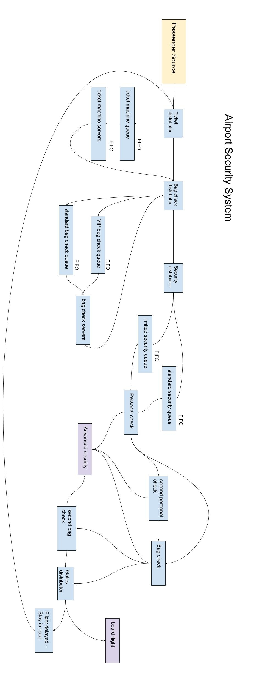

# hw1b

*I pledge my honor that I have abided by the Stevens Honor System. - Joshua Schmidt* 1/30/2020

## entities in the system

- source of passengers
- queues (lines)
- servers for bag checks
- distributors (signs, personnel) for directing people to VIP lines, security lines, etc.
- security checks
- extra security checks

## Attributes of airport security system

- source
  - arrival distribution - when the travellers are arriving
- ticket machine queue
  - physical length limitation of ticket machine queue
  - distribution of customers entering and leaving the queue
- ticket machine servers
  - how many ticket machines there are
  - how complicated the machine is for getting the ticket and confirming check-in
- bag check queues
  - how many vip customers there are
  - how many customers have checked bags
- bag check servers
  - how many servers there are for the standard queue
  - how many servers there are for the vip queue
  - how queues are structured - multiple lines for each server vs one line for all servers
- security
  - how many people have tsa pre-check or equivalent
  - physical limitations of standard and pre-check queues
  - how many items people bring on carry-on
  - frequency of bags being checked individually
  - how many items need to be taken out of bags for individual scan
  - how many people need to use the high-security body scanning machine vs the typically metal detecting machine
  - frequency of second checks triggered for bags
  - frequency of second checks triggered for body scan
- flight delays
  - distribution of flights delayed overnight, necessitating lodging
  - if airport has lodging in the secure area or if people need to leave and repeat the security process the next day

{ width=100% }

